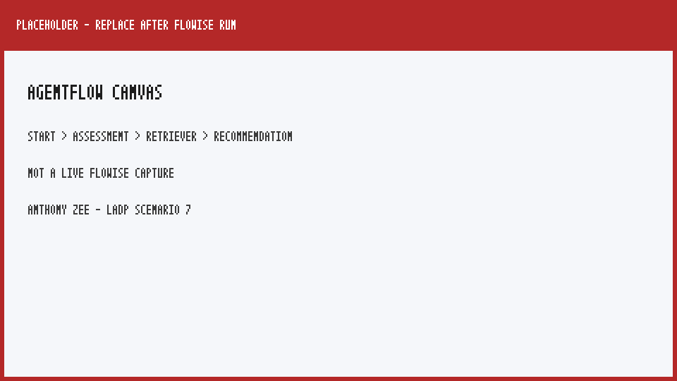
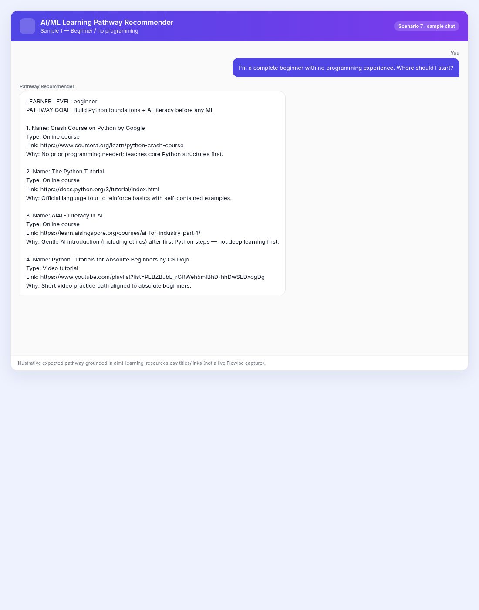
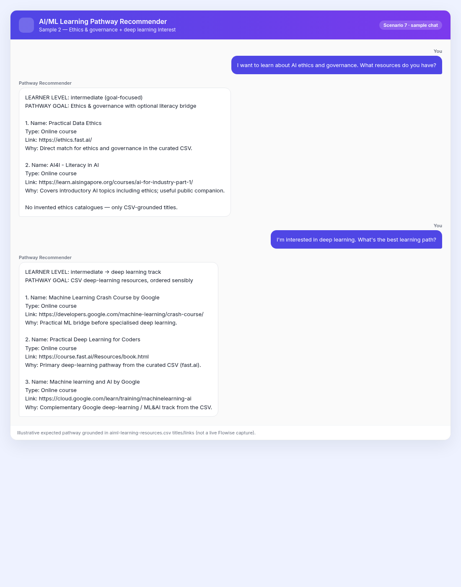
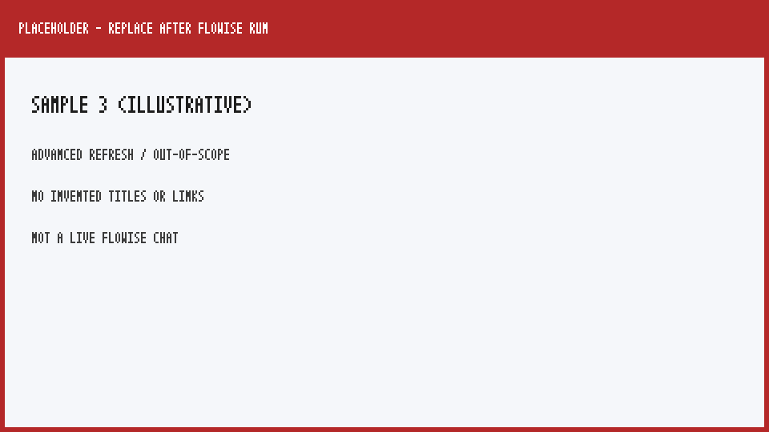

# AI/ML Learning Pathway Recommender

**Learner:** Anthony Zee (`zeekiankok92`)  
**Scenario:** 7 — AI/ML Learning Pathway Recommender (**AGENTIC**)  
**Platform:** Flowise Agentflow  
**Workflow file:** `anthony_zee_scenario_7.json`

## Why this scenario
Lifelong learning in AI/ML is noisy: the same Coursera playlist is wrong for a complete beginner and for someone who already knows Python. Capstone Scenario 7 asks for an **agentic** split — assess level first, then RAG over a curated resource CSV — which matches how a good learning advisor works and maps cleanly to evaluation criteria (effective assessment, personalised pathways, CSV-grounded titles/links, structured Name / Type / Link / Why output).

## Architecture

```
Start (chat)
  → Assessment Agent (LLM, temp 0) — classify beginner | intermediate | advanced
  → AI/ML Learning Resources Retriever (Document Store RAG over CSV)
  → Recommendation Agent (LLM, temp 0) — structured 3–5 resource pathway
```
**Assessment Agent** gathers programming experience, ML knowledge, and learning goals; emits a compact assessment + retrieval focus. It does **not** recommend courses.  
**Recommendation Agent** receives the assessment + retrieved CSV rows and returns an ordered pathway of **3–5** resources with **Name, Type, Link, Why** — grounded only in retrieved context.

## Design decisions

- **Model:** OpenAI `gpt-4o-mini`, **temperature 0** on both LLM nodes (deterministic classification + faithful titles/links). Credentials via Flowise / `OPENAI_API_KEY` — never hardcoded in the export.
- **Embeddings / chunking:** `text-embedding-3-small`; Recursive Character Text Splitter ~**800–1000** / overlap ~**100–150** so each CSV resource row (title, type, area, description, link) stays coherent as a retrieval unit.
- **KB:** Capstone Document #7 — curated `aiml-learning-resources.csv` (public course/tutorial/ebook links). Upsert locally into a Flowise Document Store; the CSV is **not** redistributed inside this PR folder (download from the course GitHub / Module 2 `documents_for_rag/` copy). After import, point the Retriever at your store (replace `REPLACE_WITH_YOUR_DOCUMENT_STORE_ID:AIML_Learning_Resources_CSV`).
- **Prompt design:** Assessment never invents background and never recommends. Recommendation never invents titles/URLs, must match level + goals, and must refuse out-of-scope / non-CSV / exam-answer requests while still allowing closest grounded public items when relevant.

## Challenges & resolutions

1. **Exported JSON does not include the vector index.** After import, upsert the CSV into a Document Store, then wire the Retriever to that store ID.
2. **Capstone `data/` path vs Module 2 CSV.** At packaging time `LADPE_Project_Phase/data/` lacked the CSV; used the Module 2 curated copy for local upsert (same public links; not committed here).
3. **One-size-fits-all risk.** Assessment classifies before retrieval; Recommendation orders prerequisites before deep learning / ethics deep-dives and skips beginner Python when the user already knows Python.
4. **Structured pathway readability.** Explicit plain-text template (`LEARNER LEVEL` / `PATHWAY GOAL` / numbered Name–Type–Link–Why × 3–5) so chat demos stay reviewable against Capstone’s structured-output criterion.

## Sample conversations

> Expected pathways use **exact titles present in the curated CSV**. After Document Store upsert, verify wording and links against retrieved chunks. Screenshots under `screenshots/` are illustrative UI captures (CSV-grounded); optional live Flowise replacements anytime.

### 1. Beginner — no programming
**Q:** I'm a complete beginner with no programming experience. Where should I start?  
**Expected:** Level **beginner**. Pathway of 3–5 items starting with Python fundamentals and/or **AI4I - Literacy in AI**, then gentle next steps — **not** *Practical Deep Learning for Coders* first. Each item: Name, Type, Link, Why. Example grounding: *Crash Course on Python by Google*, *The Python Tutorial*, *AI4I - Literacy in AI*.
### 2. Intermediate — Python, new to ML
**Q:** I know Python well but have never done ML. What should I learn next?  
**Expected:** Level **intermediate**. Skip absolute-beginner Python playlists; prefer **Machine Learning Crash Course by Google**, **StatQuest Youtube channel by Josh Starmer**, **An Introduction to Statistical Learning with Applications in Python** (or similar CSV ML rows) in a sensible order.

### 3. Ethics & governance
**Q:** I want to learn about AI ethics and governance. What resources do you have?  
**Expected:** Grounded on **Practical Data Ethics** (and optionally **AI4I - Literacy in AI**, which covers ethics). No invented ethics catalogues.

### 4. Deep learning interest
**Q:** I'm interested in deep learning. What's the best learning path?  
**Expected:** Prefer **Practical Deep Learning for Coders** and/or **Machine learning and AI by Google** from the CSV; prepend ML/Python bridges only if assessment says they are needed.
### 5. Advanced refresh (extra ≥5th query)
**Q:** I'm an experienced ML practitioner who wants a short refresh on statistical learning and then ethics for production AI.  
**Expected:** Higher level classification; prefer statistical-learning ebook(s) + **Practical Data Ethics** — personalised, not beginner Python.

### Out-of-scope
**Q:** Recommend a secret internal staff-only syllabus not in the CSV.  
**Expected:** No invented titles/links; state that nothing matching was retrieved; offer only closest public CSV items if any.

## Screenshots

| File | What it shows |
|------|----------------|
| `screenshots/canvas.png` | Agentflow canvas (Start → Assessment → Retriever → Recommendation) |
| `screenshots/sample_1.png` | Beginner / Python-then-ML pathway |
| `screenshots/sample_2.png` | Ethics & governance and deep learning |
| `screenshots/sample_3.png` | Advanced refresh + out-of-scope refusal |
Images below are **illustrative UI captures** of the expected Flowise canvas and sample chats, using **exact CSV titles/links**. They are not live Flowise recordings; replace with live captures after `OPENAI_API_KEY` + Document Store upsert if you want camera-true demos.









---

Knowledge-base CSV is downloaded from the original Capstone / Module 2 source and is not redistributed here. Cite original publishers if reused beyond this course.
