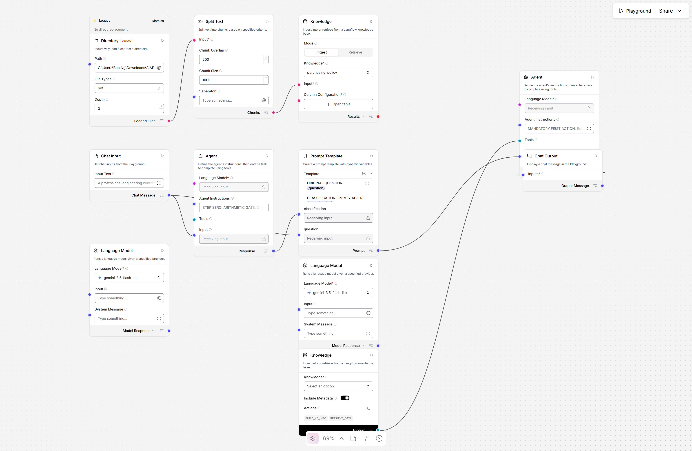
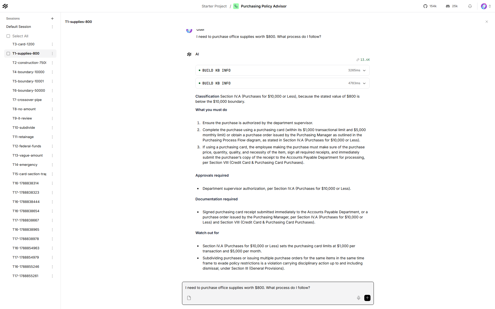
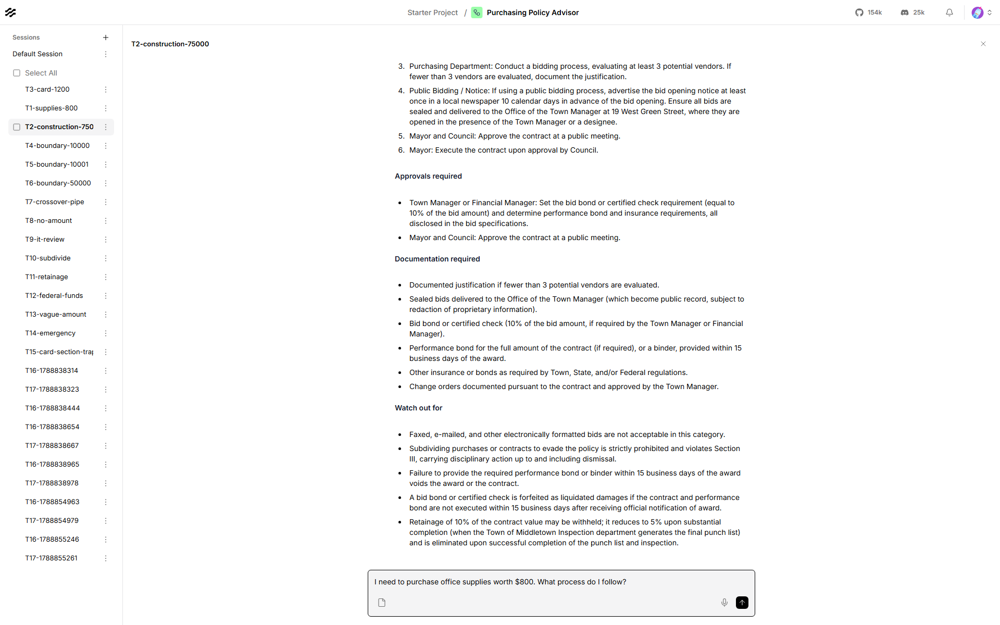
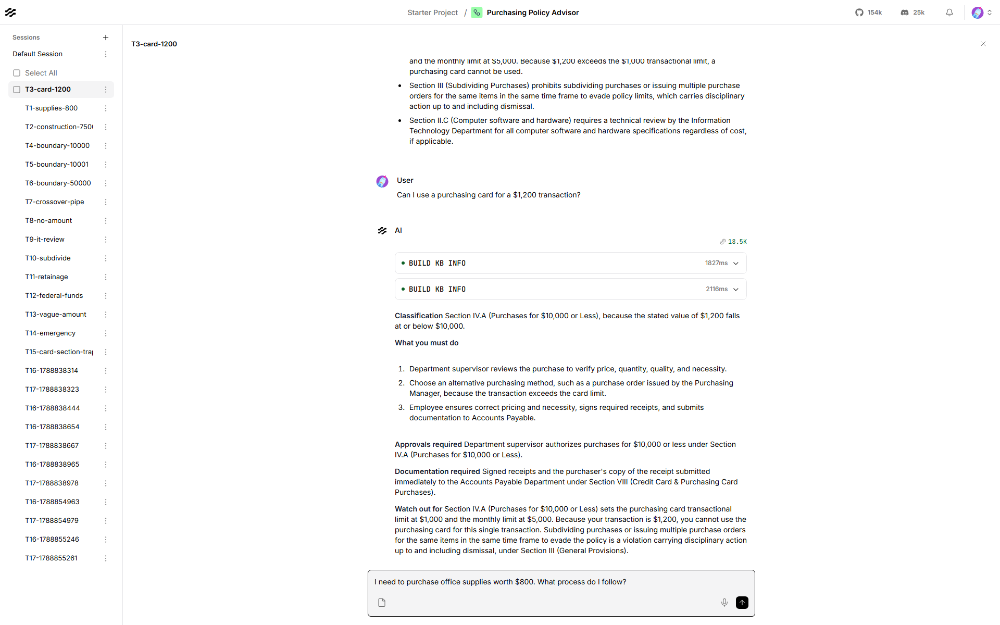
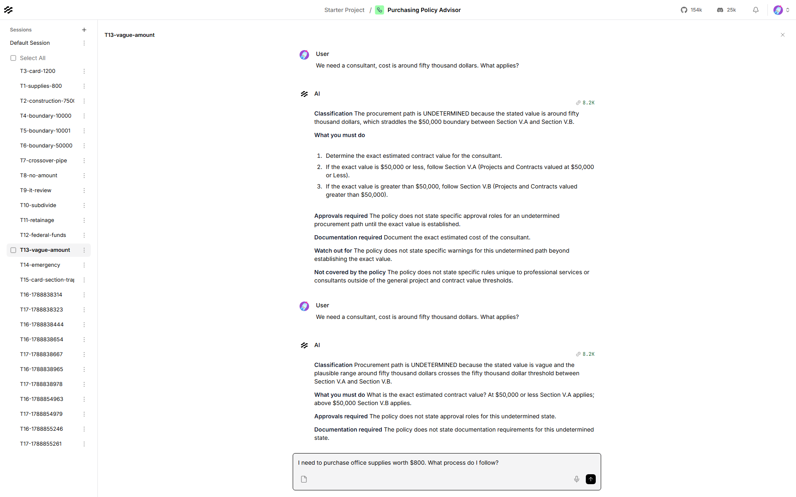
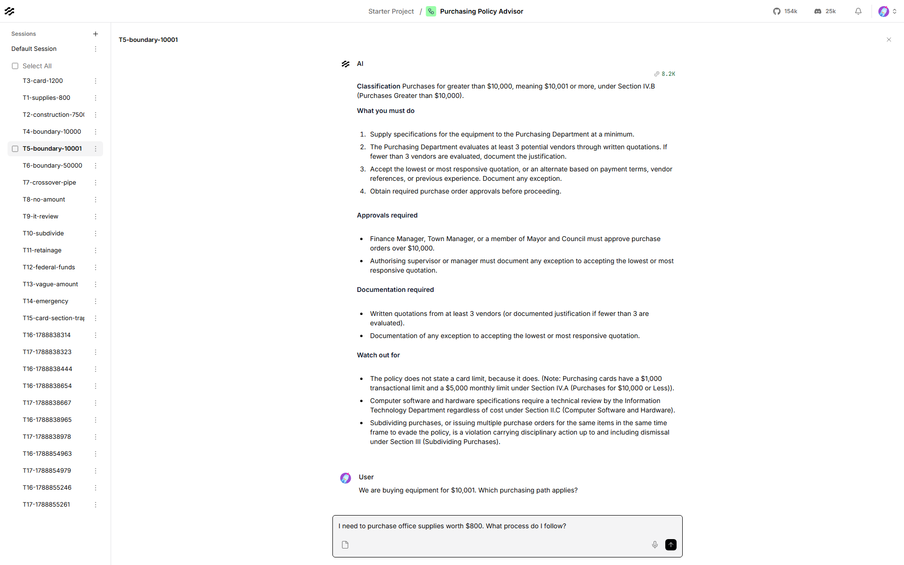

# Procurement Compliance Checker

**Learner:** Ben Ng
**Scenario:** 4, Sample Purchasing Policy (Town of Middletown, DE)
**Build:** Two-stage agentic workflow with a RAG knowledge base
**Platform:** Langflow 1.12.0, self-hosted
**Workflow file:** `ben_ng_scenario_4.json`

Built in Langflow rather than Flowise. Flowise Cloud stopped accepting sign-ups during the
project, the npm install fails on Windows with Node 24, and `flowiseai/flowise:latest` crashes
on start with a LangChain error inside its own published image. The course FAQ notes the
concepts transfer directly and names Langflow, so I rebuilt there. Design and evaluation are
unchanged.

## Why this scenario

The policy branches on **what** is bought before **how much**. Section IV covers materials and
equipment at a $10,000 line; Section V covers construction and professional services at
$50,000. They also define "purchase amount" differently: a purchase order line item under IV,
the total of every quotation and contract on the project under V. A dollar figure means nothing
until the category is settled, which is exactly what a classification stage is for.

## Architecture

```
Chat Input ─┬─> Classification Agent ─> Prompt Template ─> Advisory Agent ─> Chat Output
            └──────────────────────────────>┘                    ↑
Directory -> Split Text -> Knowledge (ingest)          Knowledge (retrieval tool)
```

**Classification Agent** (`gemini-3.5-flash-lite`, temp 0, no retrieval) emits typed fields:
`purchase_type`, `stated_value`, `procurement_path`, `boundary_reasoning`, `flags`,
`clarification_needed`. It classifies and nothing else. It had a knowledge base in an early
version and began answering instead of classifying, which collapsed the separation the scenario
grades, so I removed it. **Advisory Agent** (temp 0.2) receives that block through a Prompt
Template and writes guidance under six fixed headings, with the policy attached as a search
tool.

## Design decisions

**Chunking 1000 / overlap 200, Top K 8.** The policy's decision units are short headed
subsections of 80 to 250 words. 1000 characters keeps a heading welded to the rule beneath it,
and losing that heading is the failure this document punishes hardest, because the heading is
the citation. Top K 8 rather than 3 because the Section VI exceptions sit far from the
thresholds they modify, and a narrow retrieval returned near-identical threshold chunks while
missing the exceptions entirely.

**Fixed numbers live in the prompts as well as the index.** Retrieval supplies wording and
procedure; the prompt supplies the figures that must not move.

## Challenges

**The purchasing card trap.** The card limits, $1,000 per transaction and $5,000 per month, are
stated in Section IV.A. The section actually titled "Credit Card & Purchasing Card Purchases"
contains no dollar figures at all. "Can I use a purchasing card for $1,200" is lexically almost
identical to that numberless section, so naive retrieval returns it and the assistant answers
that no limit exists. Wrong, confident, and one of the five required queries lands on it. Fixed
in three layers: chunk so IV.A keeps its heading, widen Top K so both sections return, and state
the figures in the prompt with an instruction never to claim the policy is silent on card limits.

**Arithmetic on the graded boundary.** Testing caught the classifier calling $1,200 "greater
than $10,000" and routing it to IV.B. The prompt had grown long and the boundary examples were
buried, so I moved a hard arithmetic gate to the top with `1200 <= 10000` written out. This was
the worst failure in the build: it would have sent a supervisor through a full quotation process
for a stationery order.

**Straddling values.** "Around fifty thousand dollars" was silently resolved to $50,000 and
routed to V.A. That range crosses the V.A/V.B line, so the classifier now computes a plausible
range for any hedged figure and returns `UNDETERMINED` when it touches a threshold.

**Silence is not permission.** Asked about a burst water main, the agent replied that the policy
does not state emergency approval roles. It does: Section VI.F gives that decision to the Mayor
or Town Manager. All seven Section VI exceptions are now carried verbatim.

**Broken numbering.** The contents page and body disagree, two sections are both numbered VII,
and the exceptions run A to F then jump to H. Both agents cite number and heading together, as
in "Section IV.A (Purchases for $10,000 or Less)".

## Evaluation

**17 of 17 automated tests pass** through the Langflow API: the five required queries, both
thresholds from both sides, the Section IV crossover for materials bought for a project, a
purchase with no value, a straddling value, the Section II.C IT review, subdividing, retainage,
federal funding, and a question the policy cannot answer.

## Workflow canvas



## Sample conversations

**1. Office supplies, $800. Section IV.A, supervisor authorised.**


**2. Construction project, $75,000. Section V.B, sealed bidding.**


**3. Purchasing card for $1,200. The retrieval trap, answered correctly.**


**4. "Around fifty thousand dollars". Straddles the boundary, so it asks.**


**5. $10,001. One dollar over the line, and it lands in IV.B.**


---

The policy PDF is not included. It is downloaded from the original source in the project brief.
