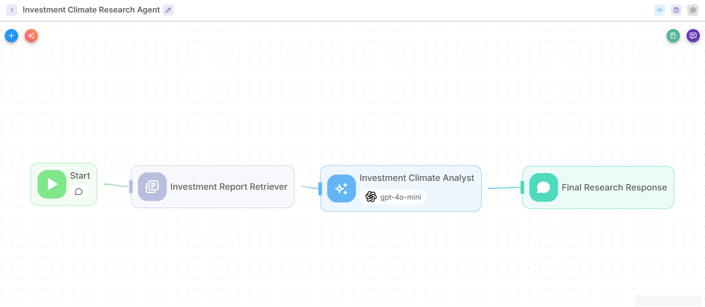
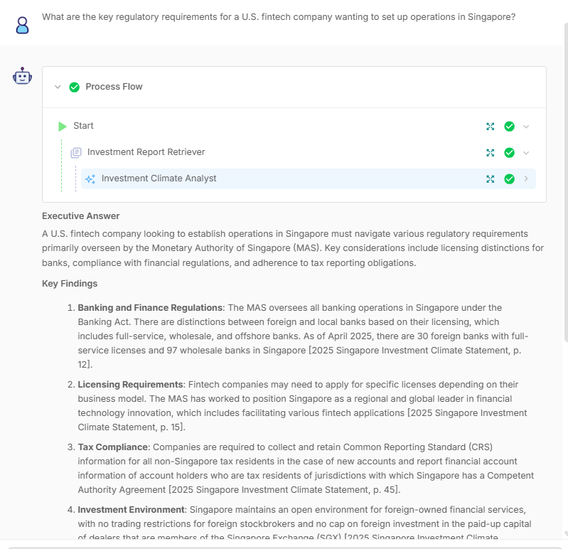
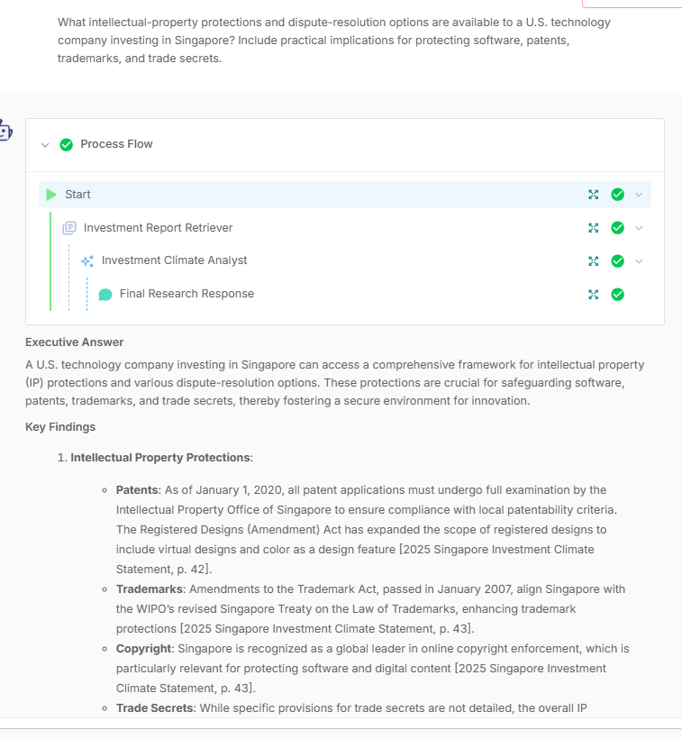
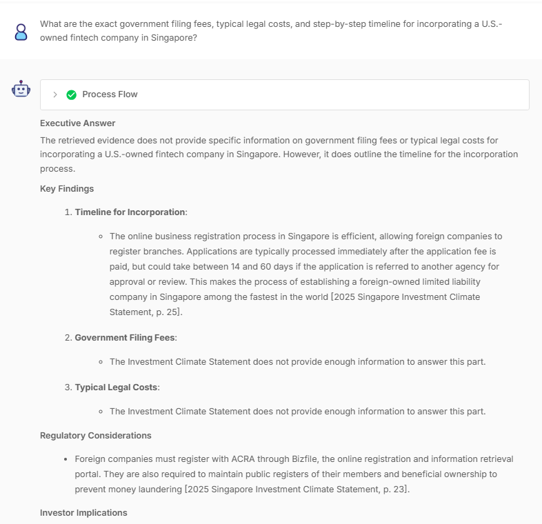

# Investment Climate Research Agent

**Learner:** Bernard Sim  
**Scenario:** 2 — Investment Climate Research Agent  
**Build:** Flowise Agentflow v2 with RAG over the 2025 *Singapore Investment Climate Statement*  
**Workflow:** `bernard_sim_scenario_2.json`

## Purpose

I selected Scenario 2 because foreign-investment research often requires connecting regulatory, labour, intellectual-property, and market-entry information from different parts of a long government report. The agent helps a consulting team produce a structured, evidence-based first-pass research brief while clearly distinguishing report-backed facts from information the source does not cover.

## Workflow and design decisions

The workflow is an explicit four-step pipeline:

`Start → Investment Report Retriever → Investment Climate Analyst → Final Research Response`

- **Knowledge base:** 2025 Singapore Investment Climate Statement, held in a Flowise Document Store.
- **Chunking:** Recursive Character Text Splitter, 1,000-character chunks with 200-character overlap. The document is loaded one page at a time so page labels are retained for citations.
- **Retrieval:** OpenAI `text-embedding-3-large` with a Pinecone index configured for its 3,072-dimension vectors; Top-K is 5. The Retriever receives the user question and returns relevant passages plus source metadata.
- **Analysis:** OpenAI `gpt-4o-mini` at temperature 0.2. Its system prompt limits the response to retrieved evidence, separates multi-part questions, requires page citations, provides a fixed Markdown structure, and includes a research-support—not legal, tax, or investment advice—disclaimer.
- **Output:** A Direct Reply node returns the Analyst result to the user.

## Challenge and resolution

The initial upsert failed because `text-embedding-3-small` produces 1,536-dimension vectors while the Pinecone index was configured for 3,072 dimensions. I changed the embedding model to `text-embedding-3-large`, matching the index. A later test showed citation placeholders because the Analyst prompt contained the Retriever’s display label rather than its runtime variable. Replacing it with `{{retrieverAgentflow_0}}` correctly passed the retrieved text and page metadata to the Analyst.

## Validation

| Query | Outcome |
| --- | --- |
| U.S. fintech regulatory requirements | Grounded regulatory analysis with report-page citations |
| Employment Pass vs S Pass | Comparison of salary and employer obligations with citations |
| IP protections and dispute resolution | Patent, trademark, copyright, trade-secret, and dispute-resolution analysis with citations |
| Investment screening and ownership restrictions | National-security screening and approval considerations with citations |
| Incorporation fees, costs, and timeline | Cited timeline; explicitly declined unsupported filing-fee and legal-cost details |

## Evidence

### Workflow canvas

### Sample conversations

