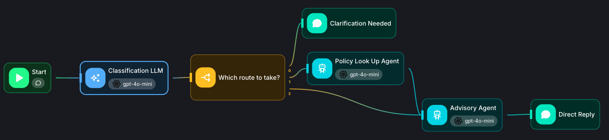

# Procurement Compliance Checker

An agentic procurement compliance workflow for the **Town of Middletown, Delaware**, based on **Purchasing Policy 1.3.1**.

The system helps department supervisors determine the appropriate procurement path for a purchase by separating
classification, policy validation, procurement guidance, and final response generation.

---

## Overview

The Procurement Compliance Checker uses a multi-stage Agentflow to determine the appropriate procurement requirements
for a purchase.

The workflow is divided into four primary responsibilities:

1. **Classification Agent** — determines the purchase type, estimated value, applicable policy section, threshold band,
   and possible exceptions.
2. **Policy Lookup Agent** — validates the classification against the actual Purchasing Policy and overrides the
   classification when the policy indicates that the original classification is incorrect.
3. **Advisory Agent** — determines the required procurement process, approvals, documentation, and applicable
   requirements using the resolved classification.
4. **Direct Reply** — communicates the final result to the user.

The workflow also supports **human-in-the-loop clarification** when the information provided by the user is insufficient
to determine the procurement path.

---

# Architecture



### Agent Responsibilities

| Component            | Responsibility                                     |
|----------------------|----------------------------------------------------|
| Classification Agent | Classifies the procurement                         |
| Human Input          | Provides missing information                       |
| Loop                 | Re-runs classification using the new information   |
| Policy Lookup Agent  | Validates/corrects classification using the policy |
| Advisory Agent       | Determines procurement process and approvals       |
| Direct Reply         | Provides the final user-facing response            |

---

# Procurement Policy

The workflow uses two primary procurement sections.

## Section IV — Materials, Supplies, Vehicles, and Capital Equipment

Section IV applies to:

* Materials
* Supplies
* Vehicles
* Capital equipment

The threshold is:

| Value           | Classification     |
|-----------------|--------------------|
| $10,000 or less | `iv_10000_or_less` |
| $10,001 or more | `iv_over_10000`    |

Materials, supplies, vehicles, and equipment purchased directly by the Town for a construction project remain classified
under **Section IV**.

---

## Section V — Construction and Professional Services

Section V applies to:

* Construction projects
* Architectural services
* Engineering services
* Land surveying
* Landscape architecture
* Geological studies
* Utility and tax rate studies
* Management studies
* Actuarial studies
* Accounting and auditing
* Financial services
* Computer-related consulting
* Similar professional services

The threshold is:

| Value                | Classification    |
|----------------------|-------------------|
| $50,000 or less      | `v_50000_or_less` |
| Greater than $50,000 | `v_over_50000`    |

---

# Classification Agent

The Classification Agent is the first decision-making component.

Its responsibility is to determine **what the user is purchasing**, rather than explain what the user should do.

The Classification Agent:

* Identifies the purchase type.
* Extracts the estimated value.
* Determines whether a value was explicitly stated.
* Determines the applicable policy section.
* Determines the applicable value band.
* Identifies possible exceptions.
* Determines whether clarification is required.

The Classification Agent does not provide procurement advice.

---

## Classification Output

The Classification Agent produces the following structured JSON:

```json
{
  "classification": "IV",
  "purchase_type": "materials_supplies",
  "estimated_value": 5000,
  "value_stated": true,
  "applicable_section": "IV",
  "value_band": "iv_10000_or_less",
  "possible_exception": null,
  "clarification_needed": false,
  "clarification_question": ""
}
```

This structured object becomes the contract between the Classification Agent and the downstream nodes.

---

## Classification Fields

### `classification`

The high-level procurement classification.

Allowed values:

```text
IV
V
unknown
```

### `purchase_type`

The type of procurement.

Allowed values:

```text
materials_supplies
construction_professional
unknown
```

### `estimated_value`

The estimated dollar value of the purchase.

If the user does not provide an amount:

```json
{
  "estimated_value": 0,
  "value_stated": false
}
```

The system must never invent an estimated value.

### `value_stated`

Indicates whether the user explicitly provided a dollar amount.

```text
true
false
```

### `applicable_section`

The applicable Purchasing Policy section.

```text
IV
V
unknown
```

### `value_band`

The threshold band applicable to the purchase.

```text
iv_10000_or_less
iv_over_10000
v_50000_or_less
v_over_50000
unknown
```

`unknown` should only be used when the applicable section or required value is genuinely unavailable.

### `possible_exception`

Identifies an exception or special condition that may require additional policy lookup.

Possible values include:

```text
emergency
continuity_of_service
negotiation
used_surplus
state_or_cooperative_contract
blanket_order
charter_exempt
purchasing_card
null
```

A possible exception does not automatically mean that the exception applies.

### `clarification_needed`

Indicates whether additional user information is required.

```text
true
false
```

### `clarification_question`

If `clarification_needed` is `true`, this contains the specific question that must be asked.

If no clarification is required:

```json
{
  "clarification_question": ""
}
```

---

# Human-in-the-Loop Clarification

The workflow should not force a classification when required information is missing.

For example:

```text
User:
I need to buy a vehicle.
```

The Classification Agent can determine:

```json
{
  "classification": "IV",
  "purchase_type": "materials_supplies",
  "estimated_value": 0,
  "value_stated": false,
  "applicable_section": "IV",
  "value_band": "unknown",
  "possible_exception": null,
  "clarification_needed": true,
  "clarification_question": "What is the estimated value of the vehicle?"
}
```

The workflow then routes to Human Input.

The user may respond:

```text
$42,000
```

The workflow loops back to the Classification Agent.

The classifier now has both the original request and the newly provided information and produces:

```json
{
  "classification": "IV",
  "purchase_type": "materials_supplies",
  "estimated_value": 42000,
  "value_stated": true,
  "applicable_section": "IV",
  "value_band": "iv_over_10000",
  "possible_exception": null,
  "clarification_needed": false,
  "clarification_question": ""
}
```

The workflow can then proceed downstream.

---

# Policy Lookup Agent

The Policy Lookup Agent is responsible for validating the Classification Agent's result against **Purchasing Policy
1.3.1**.

It must search the policy knowledge base before making a determination.

The Policy Lookup Agent does not provide the final answer to the user.

Instead, it determines whether the existing classification is supported by the policy.

---

## Classification Override

The Policy Lookup Agent receives:

```text
{{ $flow.state.classification_results }}
```

The classification is treated as an **initial classification**, not an immutable result.

The Policy Lookup Agent can:

1. Leave the classification unchanged if it is correct.
2. Correct the purchase type.
3. Correct the applicable section.
4. Correct the value band.
5. Update an applicable exception.
6. Identify missing information that prevents a reliable classification.

The Policy Lookup Agent returns the **same JSON structure** as the Classification Agent.

For example:

```json
{
  "classification": "IV",
  "purchase_type": "materials_supplies",
  "estimated_value": 8000,
  "value_stated": true,
  "applicable_section": "IV",
  "value_band": "iv_10000_or_less",
  "possible_exception": null,
  "clarification_needed": false,
  "clarification_question": ""
}
```

The updated result becomes the authoritative classification passed to the Advisory Agent.

---

# Why Policy Lookup Overrides Classification

The Classification Agent determines the likely category based on the user's description.

However, some procurement descriptions can be ambiguous.

For example:

```text
We need to purchase materials for a $100,000 construction project.
```

The overall project may be a $100,000 construction project, but if the Town is directly purchasing materials rather than
contracting for construction services, the purchase can fall under Section IV.

Therefore:

```text
User Description
       ↓
Classification
       ↓
Policy Validation
       ↓
Corrected Classification
       ↓
Advisory
```

This prevents the initial LLM classification from becoming the final authority when the policy provides a more specific
rule.

---

# Approval Checks

Approval requirements are an explicit part of the Advisory stage.

The Advisory Agent must distinguish between:

* Procurement requirements
* Approval requirements
* Contract execution
* Exception approval
* Purchase authorization

The system should determine:

1. Whether approval is required.
2. What requires approval.
3. Who is authorized to approve it.
4. When approval must occur.
5. Whether multiple approvals are required.

Possible approval authorities may include:

* Department Supervisor
* Finance Manager
* Town Manager
* Mayor
* Town Council

The workflow should not infer an approval authority unless supported by the policy.

---

# Advisory Agent

The Advisory Agent is responsible for transforming the resolved classification into actionable procurement guidance.

It receives the latest classification:

```text
{{ $flow.state.classification_results }}
```

The classification may have originated from:

* The Classification Agent, or
* The Policy Lookup Agent after correcting the initial classification.

The Advisory Agent determines:

* Applicable procurement process
* Number of required quotes
* Competitive bidding requirements
* Vendor requirements
* Required approvals
* Required documentation
* Purchasing-card requirements
* Applicable exceptions
* Construction requirements
* Professional-service requirements
* Bonds
* Insurance
* Retainage
* Change orders
* Other policy requirements relevant to the purchase

The Advisory Agent is the first component responsible for assembling the final procurement guidance.

---

# Direct Reply

The Direct Reply node is responsible for returning the final response to the user.

The user should receive:

1. A direct answer.
2. The applicable procurement process.
3. Required approvals.
4. Required documentation.
5. Relevant exceptions or conditions.
6. Relevant policy references.

The user should not receive internal routing information or raw agent state unless explicitly requested.

---

# Routing Logic

The routing node determines the next stage after classification.

Conceptually:

```text
if clarification_needed:
    → Human Input
    → Loop
    → Classification Agent

elif policy lookup is required:
    → Policy Lookup Agent
    → Advisory Agent

else:
    → Advisory Agent
```

This separates three different situations:

### Missing information

The system needs more information from the user.

```text
Classification
    ↓
Human Input
    ↓
Loop
    ↓
Classification
```

### Policy ambiguity

The system has enough information from the user, but the classification needs to be validated against the policy.

```text
Classification
    ↓
Policy Lookup
    ↓
Updated Classification
    ↓
Advisory
```

### Ready for guidance

The classification is sufficiently clear and does not require additional policy resolution.

```text
Classification
    ↓
Advisory
```

---

# Flow State

The primary state passed between agents is:

```text
$flow.state.classification_results
```

Example:

```json
{
  "classification": "IV",
  "purchase_type": "materials_supplies",
  "estimated_value": 5000,
  "value_stated": true,
  "applicable_section": "IV",
  "value_band": "iv_10000_or_less",
  "possible_exception": null,
  "clarification_needed": false,
  "clarification_question": ""
}
```

The important design principle is that there should be **one authoritative classification object**.

The Policy Lookup Agent updates this object when necessary rather than creating a second competing classification.

---

# Exceptions

The workflow supports detection and validation of special procurement situations.

## Emergency

Emergency purchases may require separate policy treatment.

The system should identify the emergency condition and retrieve the applicable policy provisions before the Advisory
Agent provides guidance.

## Continuity of Service

A breakdown or accident requiring immediate materials or equipment may qualify for special treatment.

The exception must be validated against the policy.

## Negotiation

A negotiated contract is treated as a possible exception and requires policy lookup.

## Used or Surplus

Used or surplus materials or equipment may have different requirements.

## State or Cooperative Contract

Purchases through an applicable state or cooperative contract may require separate treatment.

## Blanket Order

Warehouse stock blanket orders may have separate requirements.

## Charter Exempt

Certain annual independent audit and Town Solicitor services may be treated differently under the policy.

## Purchasing Card

Purchasing-card questions require specific lookup of the applicable purchasing-card requirements.

A purchasing card should not automatically be assumed to be permitted simply because the purchase falls below a
procurement threshold.

---

# General Policy Questions

The system must also support questions that are not about a specific purchase.

Examples:

```text
What is the retainage policy?

What are the emergency exceptions?

What are the bonding requirements?

What is the change-order process?

What are the ethics requirements?

What is the local vendor preference?
```

For these questions:

* Do not force a purchase classification.
* Do not require a dollar amount unless the question depends on a threshold.
* Search the policy knowledge base.
* Return the relevant policy findings to the Advisory Agent.
* Do not ask the user for unnecessary information.

---

# Knowledge Base

The Policy Lookup Agent must use the Town of Middletown Purchasing Policy 1.3.1 as its source.

The agent should always search the knowledge base before making policy-specific determinations.

The section numbering or threshold map alone is not sufficient to establish policy requirements.

The knowledge base is used for:

* Definitions
* Procedures
* Approval requirements
* Exceptions
* Documentation
* Construction requirements
* Professional service requirements
* Purchasing-card requirements
* Retainage
* Bonding
* Change orders
* Other policy provisions

---

# Policy Retrieval Principles

The Policy Lookup Agent should:

* Search before answering.
* Retrieve the actual policy provision.
* Use the retrieved provision to validate the classification.
* Correct the classification when necessary.
* Avoid unsupported assumptions.
* Preserve mandatory versus optional language.
* Avoid returning irrelevant sections.

The system should never fabricate a requirement that is not supported by the policy.

---

# Error Handling

## Missing Dollar Amount

If a dollar amount is required but not provided:

```json
{
  "estimated_value": 0,
  "value_stated": false,
  "value_band": "unknown",
  "clarification_needed": true
}
```

A specific clarification question must be provided.

---

## Unknown Purchase Type

If the system cannot determine whether the purchase falls under Section IV or Section V:

```json
{
  "purchase_type": "unknown",
  "applicable_section": "unknown",
  "value_band": "unknown",
  "clarification_needed": true
}
```

The system should ask a specific question about what is being purchased.

---

## Policy Information Not Found

If the knowledge base does not contain the relevant policy provision, the system must not fabricate an answer.

The downstream Advisory Agent should communicate that the policy does not address the question or that the relevant
provision could not be located, depending on the workflow configuration.

---

# Design Principles

## 1. Separation of Concerns

Each component has a narrow responsibility.

```text
Classification
    ↓
Policy Validation
    ↓
Advisory
    ↓
Response
```

This prevents a single agent from simultaneously interpreting the user's request, searching the policy, determining the
procurement process, and generating the final answer.

---

## 2. Structured Agent Communication

Agents communicate through structured JSON rather than relying on natural-language output.

This provides:

* Predictable routing
* Easier validation
* Easier debugging
* Consistent state
* Reliable downstream processing
* Easier automated testing

---

## 3. Single Source of Classification State

The workflow maintains one authoritative classification object:

```text
$flow.state.classification_results
```

The Policy Lookup Agent can correct this object.

The Advisory Agent consumes the final version.

---

## 4. No Fabricated Values

The system must never infer a dollar amount that the user did not provide.

When a value is unavailable:

```text
estimated_value = 0
value_stated = false
value_band = unknown
```

---

## 5. Human-in-the-Loop

The system can pause when required information is missing instead of making an unsupported assumption.

The user provides the missing information, and the workflow re-runs classification.

---

## 6. Policy-Grounded Decisions

Policy-specific decisions should be based on the actual Purchasing Policy knowledge base.

The system should not rely solely on an LLM's prior knowledge of procurement rules.

---

# Future Improvements

Potential improvements include:

* Add a maximum clarification-attempt limit.
* Add policy citation support to final responses.
* Add audit logging for classification overrides.
* Add more granular routing for different exception types.
