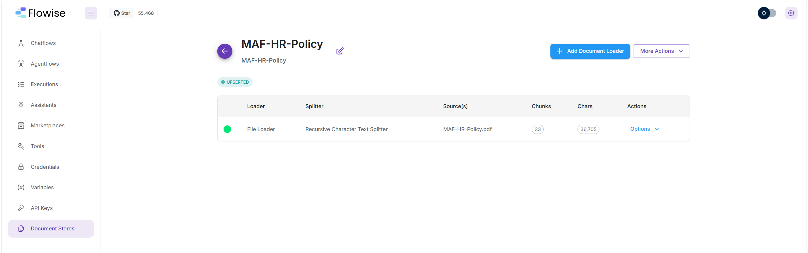
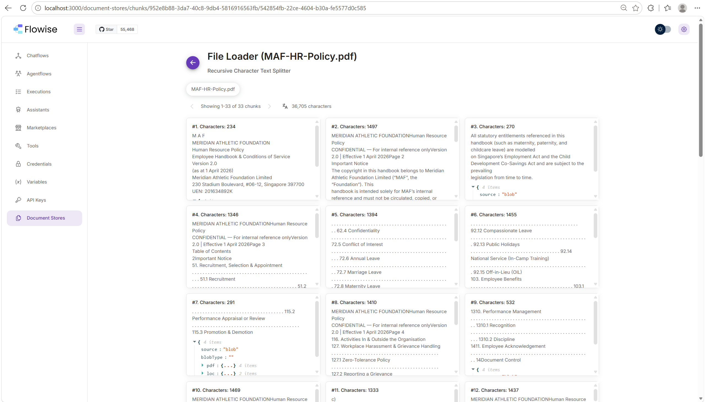
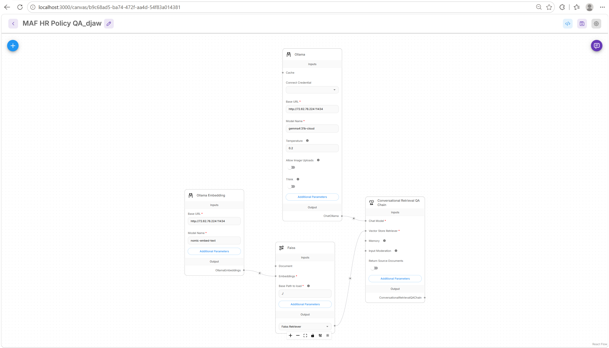
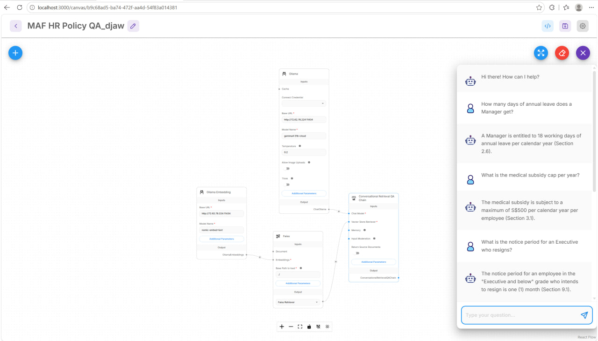
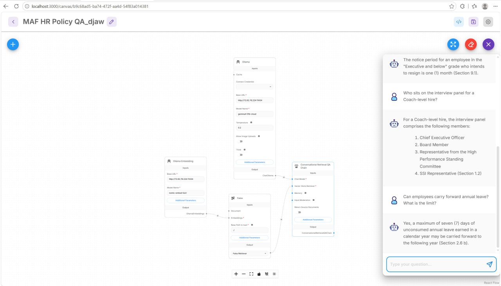
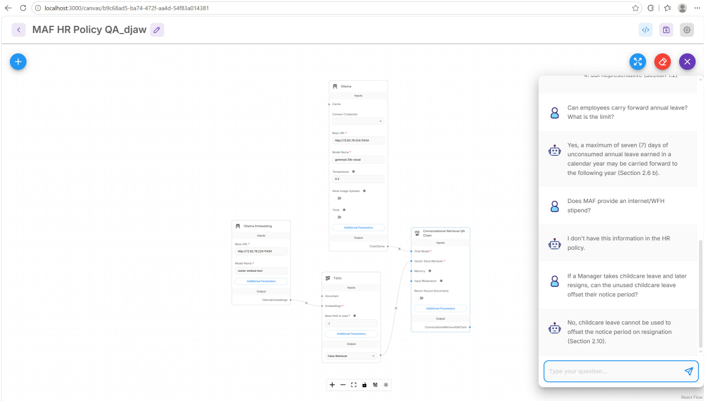

# MAF HR Policy Q&A Assistant

**Capstone submission — LADP Essentials (AI Singapore)**
**Author:** David Jack Alvis Wong
**Scenario:** Scenario 1 — HR Policy Q&A Assistant (RAG)

## Why this scenario

Chose the HR Policy Q&A Assistant because it's structurally the closest match to real compliance/tax work: a numbered-clause policy document where a wrong or made-up answer is worse than no answer at all. The skills exercised here — chunking by document structure, refusal-first prompting, and testing explicitly for hallucination — transfer directly to a future corporate secretarial / tax / compliance assistant.

## Architecture

- **Ingestion:** Flowise Document Store — File Loader → Recursive Character Text Splitter (chunk size 500, overlap 50) → 33 chunks, 36,705 characters from `MAF-HR-Policy.pdf`.
- **Embeddings:** Ollama Embedding (`nomic-embed-text`), self-hosted on a personal VPS.
- **Vector store:** Faiss.
- **Chat model:** ChatOllama (`gemma4:31b-cloud`), temperature 0.2.
- **Chain:** Conversational Retrieval QA Chain, retriever pointed at the Document Store's Faiss index.

## Design decisions

**Chunking:** the policy's subsections (2.1–2.15, etc.) are short and mostly self-contained, so chunking by section boundary — rather than pure fixed-size splitting — keeps each clause and its supporting context together. Tables (annual leave by grade, notice periods, interview panel composition) were kept together with their headers in a single chunk, since a lone table row is meaningless without it.

**System prompt:**
> "You are an HR policy assistant for Meridian Athletic Foundation (MAF). Answer only using the provided policy context — do not use outside knowledge. When you answer, cite the specific section number (e.g. 'Section 2.6'). If the answer is not in the context, say exactly: 'I don't have this information in the HR policy.' Do not guess."

The refusal-first instruction is the main anti-hallucination lever, and it's tested explicitly below (question 6).

## Testing

Tested against the 5 required questions plus 2 added ones (an out-of-scope probe and a multi-clause reasoning test). All answers were verified against the source PDF directly.

| # | Question | Result |
|---|----------|--------|
| 1 | How many days of annual leave does a Manager get? | "18 working days (Section 2.6)" |
| 2 | What is the medical subsidy cap per year? | "S$500 per calendar year (Section 3.1)" |
| 3 | What is the notice period for an Executive who resigns? | "One (1) month (Section 9.1)" |
| 4 | Who sits on the interview panel for a Coach-level hire? | CEO, Board Member, High Performance Standing Committee rep, SSI rep (Section 1.2) |
| 5 | Can employees carry forward annual leave? What is the limit? | "Max 7 days (Section 2.6b)" |
| 6 | *(added)* Does MAF provide an internet/WFH stipend? | Correctly refused — not in the document |
| 7 | *(added)* If a Manager takes childcare leave and later resigns, can it offset their notice period? | "No (Section 2.10)" |

All 7 answers matched the source document exactly, with correct section citations and no hallucinated content.

## Challenges faced

1. **Table of Contents extraction glitch.** The PDF's dot-leader ToC layout caused section numbers to scramble during text extraction (e.g. "2.6 Annual Leave" came out as "72.6 Annual Leave"). Low practical risk, since ToC text doesn't semantically match real questions and never surfaced in testing — but a good example of a real-world PDF-to-RAG data quality issue.
2. **Exported JSON doesn't carry the ingested vectors.** After importing this chatflow's JSON into a fresh Flowise instance, you'll need to re-upload `MAF-HR-Policy.pdf` to the Document Store and click Upsert before the bot can answer anything — the export captures the chatflow wiring, not the vector index itself.
3. **Semantic search misses literal section-number lookups.** Asking "What is Section 2.6 about?" fails to retrieve anything, even though "How many days of annual leave does a Manager get?" (about that exact same section) succeeds and correctly cites Section 2.6. This is a known limitation of dense/vector retrieval — it matches on meaning, not literal ID labels — not a bug in this build, and not something any of the required test questions run into.

## Screenshots

