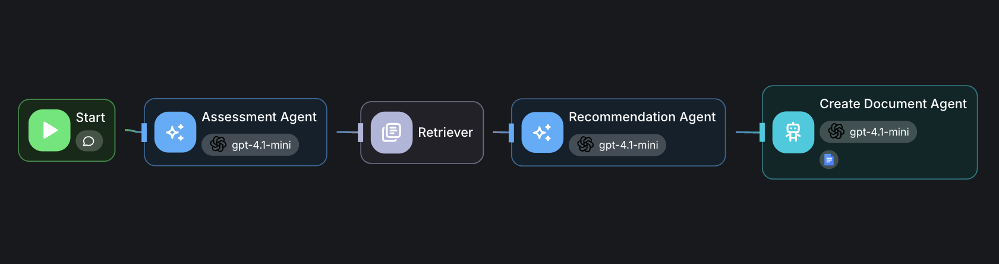
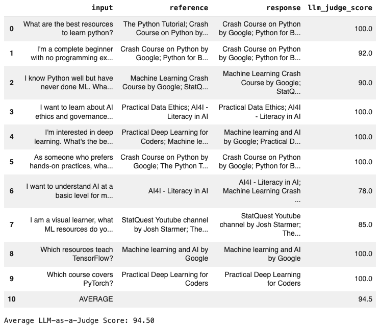

# AI/ML Learning Pathway Recommender

## Overview

I chose **Scenario 7** because it addresses a gap I experienced myself while learning data analytics. I found that learning something new can quickly become overwhelming with countless courses, tutorials, and books available online. The bigger challenge is knowing **which resource is right for your current level and learning goal**.

A complete beginner and someone who already knows Python but has never worked with Machine Learning (ML) need very different starting points. However, many learning platforms offer the same resources without considering this difference.

This project aims to solve that problem by using a multi-agent workflow to create a **personalised AI/ML learning pathway** based on each user's background, knowledge, and goals.

## Architecture

The workflow follows a three-stage pipeline:

1. **Assessment Agent** – interacts with the user to understand their programming experience, ML knowledge, and learning goals.
2. **Retriever** – searches the knowledge base for relevant learning resources based on the user's profile.
3. **Recommendation Agent** – turns the retrieved resources into a personalised learning pathway, including the course title, type, link, and reason for recommendation.

The final pathway is saved as a **Google Doc**, so users have something they can revisit later instead of losing the recommendations in a one-time chat response.

## Key Challenges

One of the main challenges was getting the Recommendation Agent to return multiple courses. I initially used a structured JSON output with a **String** type, which limited the response to a single result.

After investigating the issue, I switched the output to a **String Array**, which allowed the agent to return multiple recommendations. However, this produced valid JSON that was difficult for users to read.

I therefore moved away from structured JSON and used **few-shot prompting**, showing the model the exact plain-text format I wanted. This produced a cleaner and more user-friendly learning pathway while still maintaining the required information.

## Evaluation

I evaluated the workflow using an **LLM-as-a-Judge** approach. I tested the system with **10 different input questions**, recorded the retrieved chunks and final responses, and compared each response against a reference answer.

Each response was scored from **0–100** based on its accuracy and grounding in the available resource data.

**Average Score: 94.50 / 100**

The results gave me confidence that the workflow was able to retrieve relevant resources and turn them into accurate, personalised recommendations.
