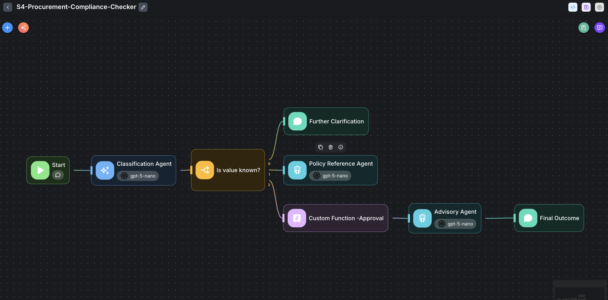
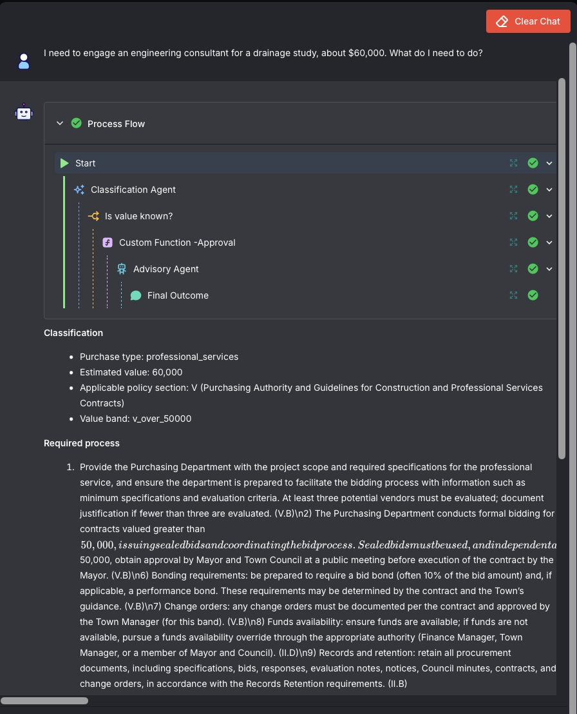
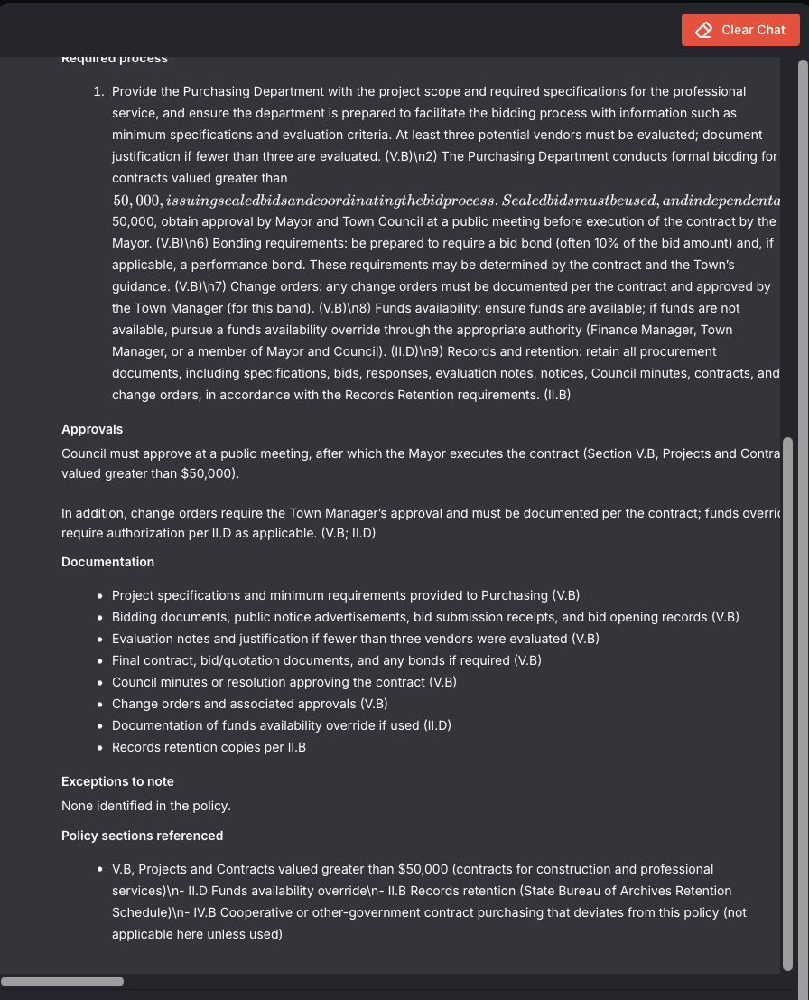
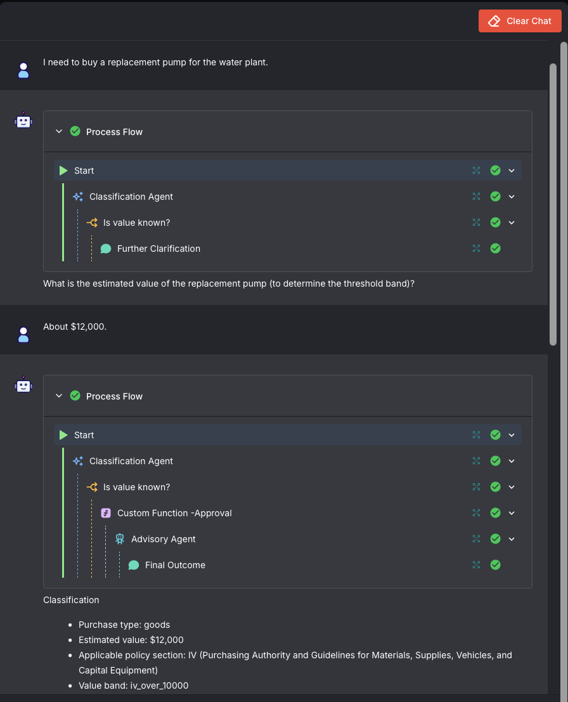
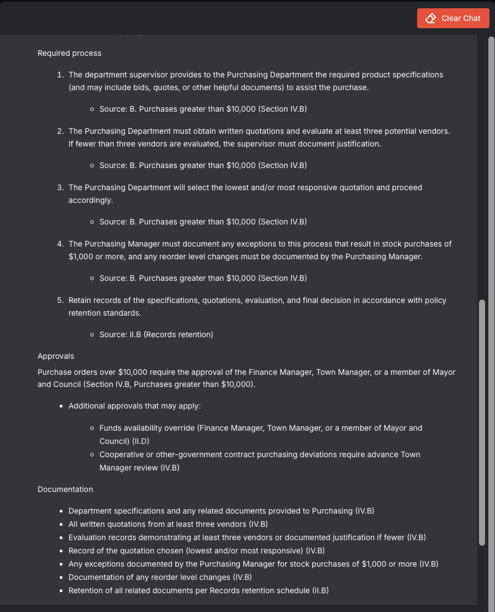
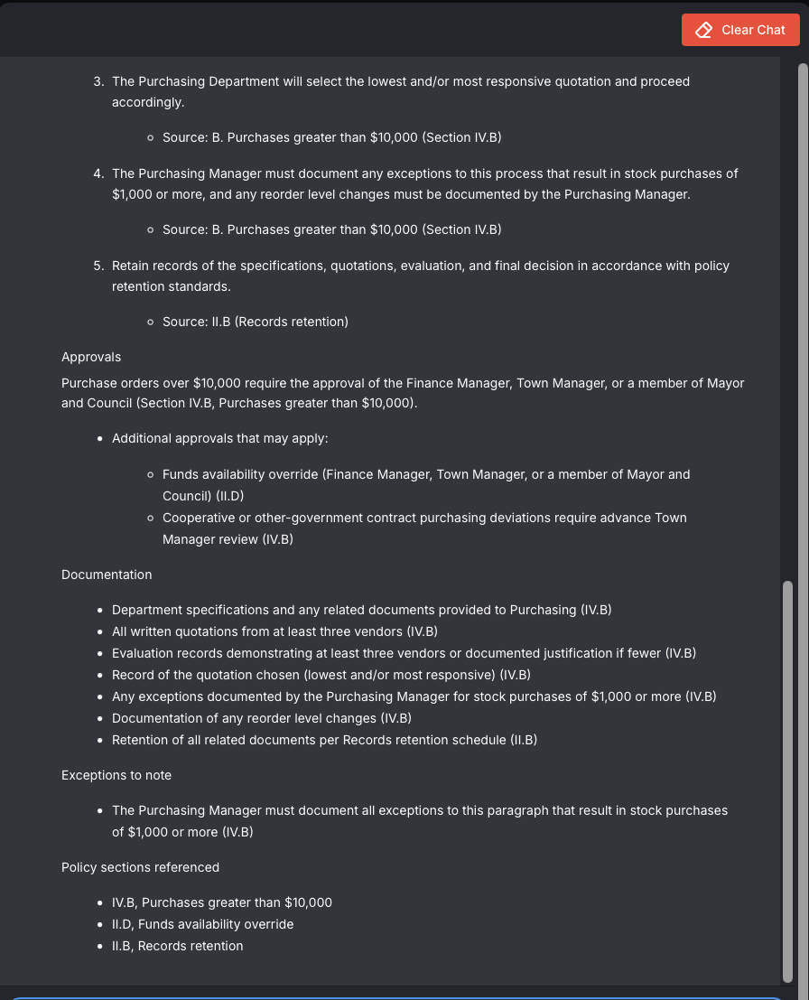
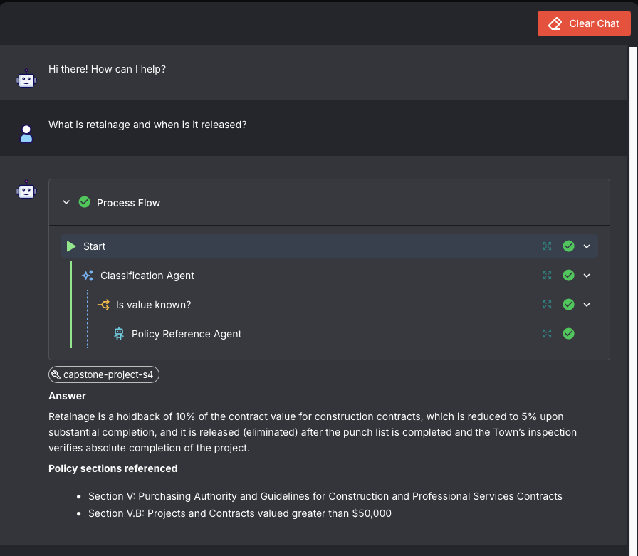

# Procurement Compliance Checker

**Learner:** Kwok Mun Choy
**Scenario:** 4 - Sample Purchasing Policy (Town of Middletown, DE)
**Build type:** Agentic Workflow (Flowise Agentflow) with a RAG knowledge base
**Workflow file:** `kwok_mun_choy_scenario_4.json`

---

## Scenario chosen and why

The Town of Middletown Purchasing Policy 1.3.1 is a compliance document rather than a narrative one. Its value sits in a small number of thresholds that are easy to misapply, and the failure mode is expensive: a supervisor who applies the wrong threshold either over-processes a small purchase or awards a contract without the approvals the policy requires.

Three properties make it an agentic problem rather than a plain question and answer one:

1. **Two separate threshold tables.** Section IV governs materials, supplies, vehicles and capital equipment at $10,000. Section V governs construction and professional services contracts at $50,000. The same dollar amount produces a different answer depending on what is being bought.
2. **The answer is unanswerable without a value.** "What do I need to do to buy a generator" has no correct answer until the amount is known.
3. **The source document contradicts itself.** The contents page numbers Receiving as VI and Exceptions as IX; the body numbers them VII and VI, and uses VII twice. Exception G does not exist. Naive citation is unreliable.

The user is a department supervisor who wants to know what to do next, not a summary of the policy.

## Architecture

```
Start -> Classification Agent -> Is value known? (3-way Condition)
                                   |
              output-0 (needs value) -> Further Clarification (Direct Reply)
              output-1 (general question) -> Policy Reference Agent
              output-2 (specific purchase) -> Custom Function -Approval
                                              -> Advisory Agent -> Final Outcome
```

Eight nodes, seven edges. The organising principle is **separation of routing from answering, and of fixed facts from retrieved prose**.

- **Classification Agent** (`gpt-5-nano`, memory on, structured output). Eight typed fields: `purchase_type`, `estimated_value`, `value_stated`, `applicable_section`, `value_band`, `possible_exception`, `clarification_needed`, `clarification_question`. Classifies only; never sees the knowledge base. Memory is on so a two-turn exchange resolves without repeating the question.
- **Is value known?** Three ordered conditions on typed state, not model judgement: clarification needed, then general question, then specific purchase.
- **Further Clarification** (Direct Reply). Emits one question and stops. No model call, no retrieval.
- **Custom Function -Approval.** Maps `value_band` to the approval authority string deterministically and writes it to state.
- **Advisory Agent** (`gpt-5-nano`, Document Store attached). Produces the six part answer for a classified purchase and reproduces the injected approval line.
- **Policy Reference Agent** (`gpt-5-nano`, Document Store attached, memory on). Handles general policy questions in a short two part format. No classification, no purchase process.
- **Final Outcome** (Direct Reply). Renders the advisory answer.

## Design decisions

**Knowledge base.** PDF loader, one document per file, Recursive Character Text Splitter at **chunk size 800, overlap 200**. Embedded with **OpenAI `text-embedding-3-small`** (1536 dimensions, cosine), stored in **Pinecone**, index and namespace `ladp-capstoneproject`, serverless. Similarity search at **Top K 8**.

The 800 character chunk is sized against this document's shape: short headed clauses of one to three paragraphs, where 800 characters usually keeps a heading with the rule beneath it. Splitting a heading from its rule is the failure this document punishes hardest, because the heading is the citation. The 200 character overlap, at 25 percent, is deliberately generous for the same reason. Top K 8 rather than 3 or 4 exists because the exceptions in Section VI sit far from the thresholds they modify; a narrow K returned four near identical threshold chunks and missed the exception entirely.

**Fixed facts go in the prompt, not the index.** Both answering agents carry a **section numbering map** and a **threshold and approval matrix** as verbatim reference text. The map encodes the document's own inconsistencies, including the duplicate VII and the missing exception G. Retrieval carries definitions, wording and procedure; the prompt carries thresholds, approval authorities and section numbers. This was the single highest yield change in the build.

**Approvals are injected, not generated.** The Custom Function writes the approval authority for the classified band into flow state, and the Advisory Agent reproduces it. The approval line is not a model judgement.

**Two agents, not one with a conditional format.** An earlier version used a single agent instructed to switch between a full purchase structure and a short answer format depending on classification. The switch held when a classification anchored it and failed when nothing did. Splitting into two agents behind a deterministic route fixed this.

**Model choice.** `gpt-5-nano` throughout. Classification is schema-constrained; answering is largely extractive once the prompt carries the fixed facts. Keeping both nodes on the same small model also made failures easier to attribute during testing.

## Challenges faced and how they were resolved

**Cross-table contamination.** Early versions applied the $10,000 goods threshold to a professional services contract, and retrieval alone could not fix it because both threshold sections are lexically similar. Moving the tables into both prompts as fixed reference text resolved it on both paths.

**Citation drift.** The model invented section numbers, and attributed records retention to the purchasing sections rather than to Section II.B. Instructing it to derive numbers from retrieved chunks did not work. Supplying a closed lookup map did.

**A confidently wrong approval statement.** The most serious defect found: for a $12,000 purchase the agent asserted that no Finance Manager or Town Manager sign-off was required, where Section IV.B requires exactly that. This was an affirmative negative claim, not a retrieval miss, and prompt instruction alone did not remove it. Deterministic state injection did.

**Schema-constrained citations, attempted and abandoned.** An enum-constrained `citations` field with a downstream validator node was built to make invented sections structurally impossible. It failed in five distinct ways across successive configurations: variables out of scope in the rendering node, JSON truncation on the default token limit, the model echoing the JSON schema back as content, the validator reading conversation history rather than its intended input, and finally echoing its own system prompt. It was removed. The prompt-level lookup map already produced correct citations without it, so the constraint was hardening a defect that was already fixed.

**Deterministic injection displaced retrieval.** Once the thresholds and approvals were in the prompt, the Advisory Agent's retrieval calls dropped from four to one. Accuracy improved and the RAG component became less load-bearing on that path. This is a genuine trade-off rather than a bug, and it is documented rather than reversed.

**Wiring faults outnumbered prompt faults.** The general-question path took five attempts. Only the last two were about prompt design. The first three were wiring: a literal placeholder left in the system prompt, no user message passed to the agent, and memory switched off so it had no conversation to read. That distinction matters, because only prompt-design failures say anything about model capability.

## Screenshots and evaluation

### Workflow canvas


### Sample 1 - Section V, above threshold
*"I need to engage an engineering consultant for a drainage study, about $60,000. What do I need to do?"*




**Correct.** Classified as professional services, Section V, `v_over_50000`, routed past clarification. The process covers formal bidding, at least three vendors, sealed bids, Council approval at a public meeting followed by execution by the Mayor, bid and performance bonds, retainage, and change orders approved by the Town Manager for this band. Records retention is correctly attributed to II.B. Every citation resolves to a real section.

**Residual defect.** Literal `\n2)` and `\n6)` sequences appear in the rendered text, and the markdown renderer interprets consecutive dollar signs as LaTeX, italicising part of step 2. Cosmetic, but it makes one step hard to read.

### Sample 2 - clarification path, then resolution
*"I need to buy a replacement pump for the water plant."* then *"About $12,000."*





**Correct, and this is the before-and-after that matters.** No value stated, so the condition routed to Direct Reply, which asked one question and stopped without touching the knowledge base. The follow-up supplied only a number, and classifier memory combined it with the earlier turn to produce Section IV, `iv_over_10000`. Written quotations, the three vendor minimum, and the lowest or most responsive quotation rule are all correct.

The Approvals block now reads: purchase orders over $10,000 require the approval of the Finance Manager, Town Manager, or a member of Mayor and Council. An earlier build of this same flow asserted the opposite. Deterministic injection closed it.

**Residual defect.** Step 4 and the exceptions block cite the warehouse stock provision, requiring the Purchasing Manager to document stock purchases of $1,000 or more, and attribute it to IV.B. That provision sits in the preamble to Section IV, not IV.B, and concerns warehouse stock rather than an open market pump purchase. Mis-attributed and not relevant to the question.

### Sample 3 - general policy question, short format
*"What is retainage and when is it released?"*



**Correct.** Routed to the Policy Reference Agent, retrieved, and answered in the first sentence: a ten percent holdback of contract value, reduced to five percent at substantial completion, released once the punch list is complete and inspection confirms the project is finished. Short two part format, no threshold tables, no purchase process.

**Residual defect.** The prompt asks the agent to flag provisions whose wording is broader than their location. Retainage is worded to cover all construction contractors and vendors but sits under V.B, projects over $50,000. The answer cites V.B without noting the tension.

### What the evaluation shows

All three samples now return correct answers, correct routing and resolvable citations. The clarification loop resolves in one turn without repeating itself, and format selection between the full and short structures is correct on every path.

The consistent pattern across the whole build is that **deterministic components were stable from the moment they were built, and prompt-governed components were not stable once**. Routing on typed state, condition ordering, and injected approvals never regressed. Section numbering, citation scope, quotation discipline and answer focus each held in one run and failed in the next under an unchanged flow. Every material fix in this project involved moving a fact out of the model's judgement and into either the prompt as fixed text or the graph as deterministic logic.

One earlier run produced a fabricated verbatim quotation, splicing the lowest-quotation rule together with exception language and presenting it in quotation marks. The Advisory Agent is now instructed never to use quotation marks at all, on the basis that the model cannot reliably tell when it is quoting and when it is reconstructing.

## Known limitations

- **Residual accuracy defects remain**, as listed per sample above. This is a drafting aid for a supervisor who will still check the policy, not a substitute for it.
- **Prompt-governed behaviour is not stable run to run.** Defects fixed in one run reappeared in later runs of an unchanged flow.
- **Retrieval is displaced on the classified path.** With the thresholds in the prompt, the Advisory Agent searches less than it did. A Retriever node placed before the agent would restore guaranteed retrieval.
- **No Record Manager on the Document Store.** Re-upserting duplicates vectors rather than replacing them.
- **Purchasing Card Policy 1.6.1 is not in the knowledge base**, so card questions are answerable only as far as Section IV.A goes.
- **Similarity search only.** Given the document's numbering defects, hybrid or keyword-boosted search would likely improve citation accuracy.

## Notes for anyone importing this workflow

Both answering agents reference a Flowise Document Store by ID (`Capstone-Project-S4`). After importing:

1. Create your own Document Store from the Town of Middletown Purchasing Policy PDF using the loader, splitter, embedding and vector store settings above.
2. Re-point the Advisory Agent and the Policy Reference Agent at your store.
3. Select an OpenAI credential on all four model nodes and a Pinecone credential on the vector store. No credentials are included in the export.

A local vector store such as Chroma or FAISS may be substituted for Pinecone without changing the flow logic, provided Top K stays at 8.

**Source document:** Town of Middletown, Delaware, Purchasing Policy 1.3.1, Rev 01, approved 2 February 2009. Downloaded from the original source. Not redistributed in this folder.
