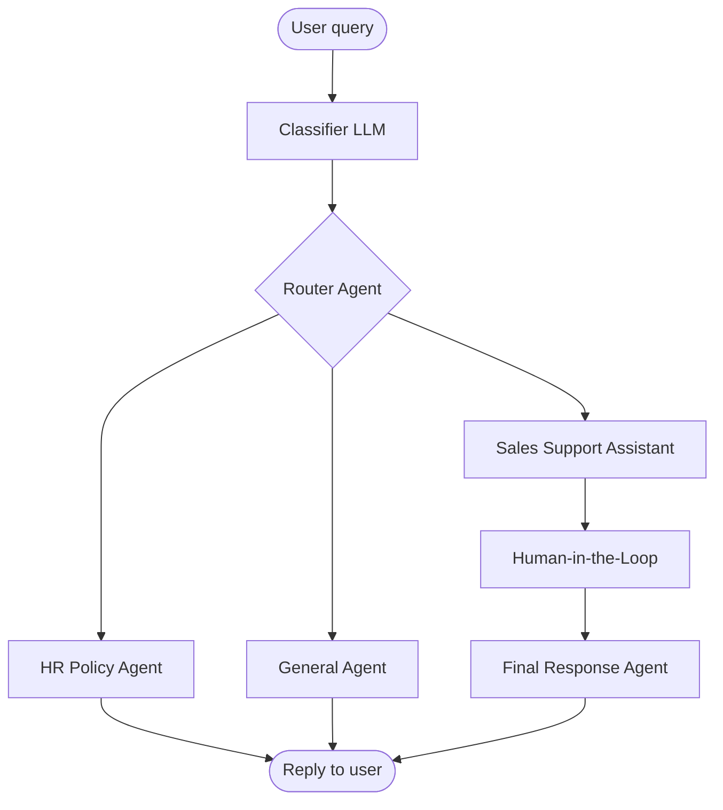

# Ryland Goh — Capstone Contribution (Scenario 1)

**Contributor:** Ryland Goh  
**Workflow export:** `ryland_goh_scenario_1.json`  
**Platform:** Flowise Agentflow

---

## Scenario Choice

I chose **Scenario 1 — HR Policy Q&A Assistant** using the Meridian Athletic Foundation (MAF) HR Policy PDF.

MAF is a sports organisation, so I extended the base RAG requirement into a **multi-agent Agentflow** that also handles customer-facing sales enquiries about MAF programmes and products. This mirrors a realistic internal assistant: employees ask HR questions, while members or customers ask about training programmes — and unrelated queries are rejected cleanly.

---

## Workflow Overview

**Three routes from the Router:**

| Route | Agent | Purpose |
|-------|-------|---------|
| 0 | HR Policy Agent | RAG answers from MAF HR Policy → reply to user |
| 1 | Sales Support Assistant | Programme & product recommendations → human review → final reply to user |
| 2 | General Agent | Polite decline → reply to user |

1. **Classifier LLM** — classifies the user question as HR Policy, Sales Support, or Other (structured JSON output).
2. **Router Agent (Condition Agent)** — routes to the matching specialist agent using three predefined scenarios.
3. **HR Policy Agent** — answers from the `MAF_HR_policy` document store only; no web search; concise, factual responses.
4. **Sales Support Assistant** — answers from an embedded MAF product & programme catalog in the system prompt; recommends programmes based on user goals.
5. **Human-in-the-Loop** — reviewer approves or rejects the Sales Support draft before it is sent to the user; rejection loops back (max 5 iterations).
6. **Final Response Support Agent** — polishes the approved Sales Support reply for the customer.
7. **General Agent** — politely declines questions outside HR and Sales Support scope.

---

## Design Decisions

### Model

- **Azure OpenAI GPT-5.2** across all nodes (via Flowise Azure Chat OpenAI integration).
- **Temperature:** 0.2 for Sales Support (factual recommendations), 0.9 for HR/Router/Classifier (natural routing), 0.3 for Final Response (consistent polish).

### Chunking & Retrieval (HR Policy RAG)

The MAF HR Policy is a structured document with numbered sections. In Flowise Document Store (`MAF_HR_policy`):

- **Splitter:** Recursive Character Text Splitter — preserves section boundaries better than fixed arbitrary cuts.
- **Chunk size:** ~1,000 characters — large enough to keep a full policy clause together (e.g. leave entitlements, notice periods).
- **Chunk overlap:** ~200 characters — reduces context loss at section boundaries during retrieval.
- **Embeddings:** Azure OpenAI embedding model (paired with the document store vector index).
- **Source documents returned:** enabled on the HR agent for traceability during testing.

### Prompt Design

| Agent | Prompt intent |
|-------|---------------|
| HR Policy Agent | Answer only from the HR KB; no web search; no assumptions; direct professional tone |
| Sales Support Assistant | Recommend MAF programmes/products from the embedded catalog; ask clarifying questions; refuse to invent prices or policies |
| General Agent | Decline out-of-scope queries; remind users the bot handles HR Policy and Sales Support only |
| Router / Classifier | Match user intent to one of three routing scenarios |
| Final Response Agent | Output the human-approved reply only; no added content or metadata |

---

## Challenges & Resolutions

| Challenge | Resolution |
|-----------|------------|
| HR and sales queries mixed in one chatbot | Two-stage routing: Classifier LLM + Condition Agent with explicit scenario definitions |
| Sales responses needed quality control | Human-in-the-Loop with approve/reject; reject path loops back to Sales Support with feedback |
| Out-of-scope questions (e.g. weather) | Dedicated General Agent with a strict scope-decline prompt instead of letting RAG agents hallucinate |
| HR answers drifting outside the policy | HR agent constrained to document store only; system prompt forbids web search and out-of-KB commentary |

---

## Testing

Tested with 5+ queries. Representative examples:

### 1. HR Policy — side business while employed

**User:** `what if i have a side business when employed at MAF?`  
**Routed to:** HR Policy Agent  
**Result:** Answered accurately with citations from the HR policy:

> While employed by the Foundation, an employee may not be involved or engaged, directly or indirectly, in any other commercial activity, especially any activity related to the Foundation's sport, without the prior written consent of the Foundation.
>
> Even where permission is granted, the outside activity must not adversely affect the employee's duties or performance during office hours or otherwise.
>
> The employee must also avoid situations that may cause, or may be perceived as causing, a conflict of interest, and must declare any vested interests and keep the Foundation informed of any actual or potential conflict of interest throughout employment.

### 2. HR Policy — annual leave carry forward

**User:** `Can employees carry forward annual leave? What is the limit?`  
**Routed to:** HR Policy Agent  
**Result:** Answered accurately with citations from the HR policy:

> A maximum of seven (7) days of unconsumed annual leave earned in a calendar year may be carried forward to the following year. Carried-forward leave must be consumed by the end of that following year, failing which it will be forfeited.

### 3. Sales Support — sporting goals programmes

**User:** `i wanna find out the programmes available to help me achieve my sporting goals`  
**Routed to:** Sales Support Assistant → Human-in-the-Loop → Final Response Agent  
**Result:** Recommended relevant MAF training programmes (e.g. Performance Training, Elite Athlete Program) based on user goals.

### 4. Out of scope — weather

**User:** `whats the weather now`  
**Routed to:** General Agent  
**Result:** Politely declined; explained the chatbot only handles MAF HR Policy and Sales Support.

---

## Workflow Canvas

> **Note:** Add screenshot PNGs to the `screenshots/` folder before submitting the PR. Filenames above match the expected images.
