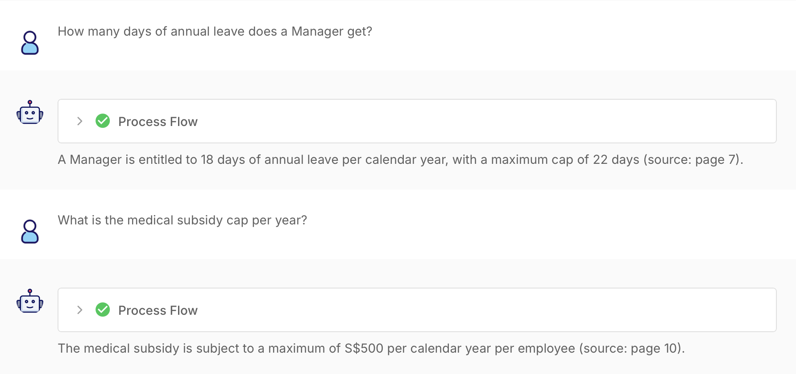
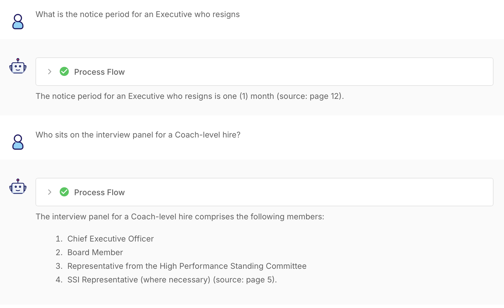
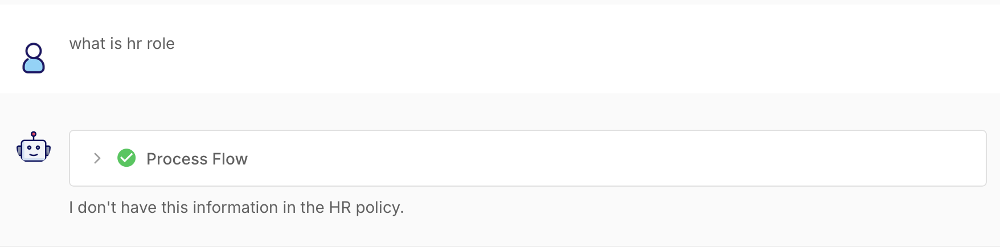

# MAF HR Policy RAG Chatflow

## Scenario and Rationale
I chose the **Meridian Athletic Foundation (MAF) HR Policy chatbot** because employees often need quick, factual answers on leave, medical benefits, resignation, and recruitment procedures. A Retrieval-Augmented Generation (RAG) approach is appropriate because it grounds responses in the official HR policy and reduces hallucination risk.

## Design Decisions
The Flowise workflow uses **Recursive Character Text Splitter → PDF File Loader → OpenAI Embeddings → In-Memory Vector Store → Conversational Retrieval QA Chain**, with **ChatOpenAI** as the language model.

- **Chunking:** Recursive splitting with **1,000-character chunks** and **150-character overlap**. This helps preserve numbered sections and keeps related policy conditions together.
- **Embeddings:** `text-embedding-3-small`, chosen for a strong balance of retrieval quality, speed, and cost for a small policy corpus.
- **Retrieval:** **Top K = 4**, giving the LLM several relevant chunks without excessive unrelated context.
- **LLM:** Temperature **0** for consistent factual responses.
- **Prompt:** The model is instructed to answer **only from retrieved HR-policy context**, never guess, and return exactly **“I don't have this information in the HR policy.”** when the answer is unavailable.

## Challenges and Resolution
The main challenge was balancing chunk size and retrieval precision. Very small chunks can separate job grades from their entitlements, while large chunks can mix unrelated rules. I used recursive 1,000-character chunks with 150-character overlap and tested retrieval using policy-specific questions. To prevent unsupported answers, I used a strict grounding prompt, temperature 0, and an explicit fallback response.

## Evidence

### Workflow Canvas
> **Insert Flowise workflow canvas screenshot here.**

### Sample Conversations

**1. Annual leave and medical subsidy**

**2. Executive notice period and Coach-level interview panel**

**3. Out-of-scope / missing-information handling**

