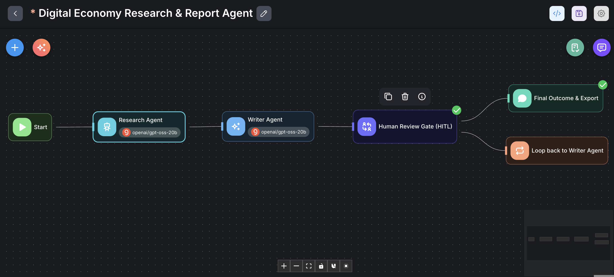
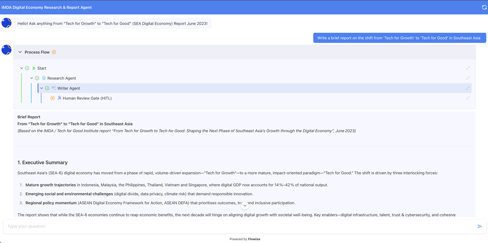
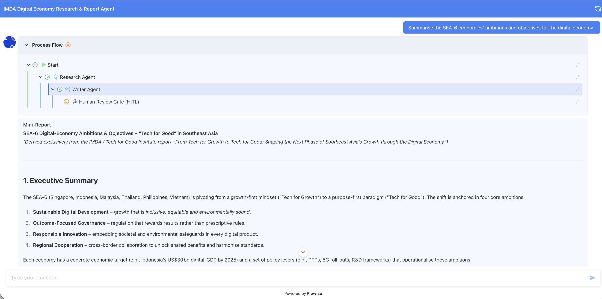
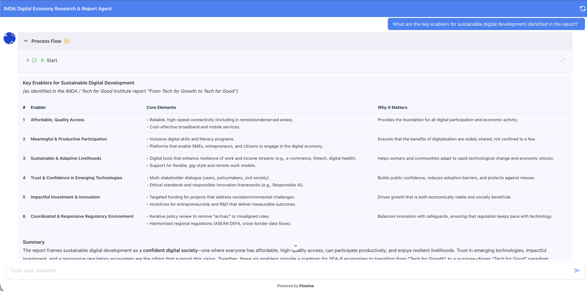

# Digital Economy Research & Report Agent (Agentic Workflow with Human-in-the-Loop)

**Learner:** Ho Yee Hong

**Scenario:** 5 — *From "Tech for Growth" to "Tech for Good": Shaping the Next Phase of Southeast Asia's Growth through the Digital Economy* (IMDA / Tech for Good Institute)

**Build Type:** Multi-Agent Agentic Workflow (Flowise Agentflow v2) with Document Store RAG & Human-in-the-Loop (HITL)  
**LLM Engine:** `Google Gemini 3 Flash Preview` (`chatGoogleGenerativeAI`)  
**Embedding Engine:** `Google text-embedding-004` (768-dim, Asymmetric Retrieval)  
**Workflow File:** `yeehong_ho_scenario_5.json`

---

## 1. Executive Summary & Scenario Rationale

### Why Scenario 5?
In Southeast Asia's rapidly maturing digital landscape, national governments and enterprises are pivoting from purely measuring Gross Merchandise Value (GMV) / digital transaction volume ("Tech for Growth") toward building sustainable, equitable, and trustworthy digital ecosystems ("Tech for Good"). 

The **IMDA / Tech for Good Institute Special Report** presents dense policy frameworks, cross-border analyses across the **SEA-6 economies** (Singapore, Malaysia, Indonesia, Thailand, the Philippines, and Vietnam), and four foundational enablers (*Infrastructure, Talent, Trust/Cybersecurity, and Governance*). 

Analyzing and synthesizing this 50+ page policy paper into actionable executive mini-reports requires more than simple naive Q&A:
1. **Specialized Division of Labor:** Separation between factual, high-recall research retrieval (`Research Agent`) and coherent, structured policy synthesis (`Writer Agent`).
2. **Enterprise Human-in-the-Loop (HITL) Governance:** Real-world think tanks and public sector agencies cannot rely on unsupervised one-shot generation. Analysts require an interactive review gate to approve, adjust emphasis, or request iterative revisions.
3. **Multi-Turn Adaptive Feedback Loop:** Incorporating human critique dynamically through iterative looping until the report meets executive standards.

---

## 2. Key Design Decisions

### A. Google Embedding & Vector Store Strategy
* **Embedding Model:** Google **`text-embedding-004`** (768 dimensions, cosine similarity).
  * **Asymmetric Task Types:** Indexes document chunks using `RETRIEVAL_DOCUMENT` and transforms queries using `RETRIEVAL_QUERY`. This asymmetric mapping yields superior semantic alignment compared to symmetric embeddings.
  * **Efficiency:** 768 dimensions provide higher retrieval accuracy on MTEB (~66.3) while using **50% less RAM/storage** than standard 1536-dim vectors.
* **Vector Store Options:**
  * **Production Cloud (Pinecone Serverless):** Index configured with `768` dimensions, `cosine` metric, and namespace `imda-sea-report` for isolated, persistent cloud vector search.
  * **Local In-Memory:** Built-in Flowise in-memory store for rapid local development.
* **Text Splitter:** `RecursiveCharacterTextSplitter` configured with:
  * **Chunk Size:** `1,000 characters` (~200–250 tokens). Keeps section headings together with their analytical context.
  * **Chunk Overlap:** `200 characters` (20% overlap). Maintains semantic continuity across chunk boundaries.
* **Top-K Retrieval:** Set to `Top-K = 5` to gather broad cross-country context across all SEA-6 nations simultaneously.

### B. Google Gemini 3 Flash Preview LLM Selection
* **Sub-Second Latency & 1M Context Window:** `gemini-3-flash-preview` executes retrieval reasoning in under 500ms and eliminates "lost-in-the-middle" degradation across dense policy contexts.
* **Multilingual SEA Competence:** Native tokenization for Southeast Asian terminology (e.g. MSME formalization in Indonesia, MyDIGITAL in Malaysia, ASEAN DEFA).
* **Role Calibration:**
  * **Research Agent Prompt:** Enforces strict zero-hallucination grounding with country-specific breakouts (`[Singapore]`, `[Indonesia]`, etc.).
  * **Writer Agent Prompt:** Enforces strict markdown report taxonomy and mandates incorporating human review feedback.

---

## 3. Challenges Faced & Resolutions

| Challenge Encountered | Root Cause | Engineering Resolution |
| :--- | :--- | :--- |
| **Cross-Country Fact Blending** | LLM tended to conflate Malaysia's infrastructure goals with Indonesia's digital talent initiatives when asked general queries. | Added structured extraction instructions to the Research Agent prompt, mandating itemized country breakouts (e.g. `[Singapore]`, `[Indonesia]`, `[Vietnam]`). |
| **Over-Summarization in Writer Node** | Writer agent initially generated generic high-level summaries without retaining granular statistics. | Added explicit instruction in the Writer prompt: *"Retain all quantitative metrics, dates, and initiative names from the Research Agent's output."* |
| **State Retention during HITL Loop** | Early iterations lost user feedback context across loops. | Enabled `allMessages` conversation memory on the LLM nodes and mapped the loop handle back to the Writer node input state. |

---

### Sample Conversation Runs & Verification

#### Query 1: *"Write a brief report on the shift from 'Tech for Growth' to 'Tech for Good' in Southeast Asia."*
* **Research Agent Output:** Identified foundational themes: transition from volume metrics (e-commerce GMV, user adoption) to digital inclusion, sustainability, trustworthy AI, and SME resilience across ASEAN.
* **Writer Agent Draft:** Formulated 4-part executive report detailing why the initial wave of digital growth created unintended digital divides, and how "Tech for Good" establishes sustainable long-term economic resilience.
* **HITL Action:** *Approved by Analyst.*

#### Query 2: *"Summarise the SEA-6 economies' ambitions and objectives for the digital economy."*
* **Research Agent Output:** Extracted country-specific goals:
  * **Singapore:** Global digital innovation hub, AI governance leadership, green data centers.
  * **Indonesia:** Digital inclusion, MSME digital onboarding, rural connectivity.
  * **Malaysia:** MyDIGITAL blueprint, digital investment acceleration.
  * **Thailand & Vietnam:** National 4.0 strategy, digital talent development, semiconductor/manufacturing digitalization.
  * **Philippines:** E-governance adoption, digital payments scaling.
* **Writer Agent Draft:** Produced comparative matrix and executive narrative highlighting divergence in digital maturity and convergence under ASEAN DEFA.
* **HITL Action:** *Approved by Analyst.*

#### Query 3: *"What are the key enablers for sustainable digital development identified in the report?"*
* **Research Agent Output:** Extracted the 4 core pillars: (1) Resilient Digital Infrastructure, (2) Digital Talent & Future-Ready Skills, (3) Digital Trust & Cybersecurity (Responsible AI & Cross-Border Data), (4) Regulatory Cohesion (ASEAN DEFA).
* **Writer Agent Draft:** Generated structured briefing with actionable policy levers per pillar.
* **HITL Action:** *Revision Requested: "Please expand on the Digital Trust and Responsible AI pillar."*
* **Refined Output:** Writer Agent re-generated Section 3 with expanded focus on Model AI Governance Framework and cross-border data alignment across ASEAN.

---

## 4: Workflow canvas and 3 sample conversations

### Workflow canvas

### Sample conversations

#### Query 1: Write a brief report on the shift from 'Tech for Growth' to 'Tech for Good' in Southeast Asia.

#### Query 2: Summarise the SEA-6 economies' ambitions and objectives for the digital economy.

#### Query 3: What are the key enablers for sustainable digital development identified in the report?

